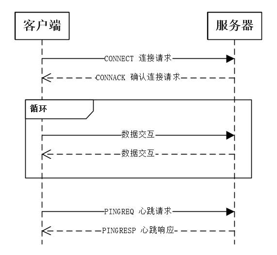
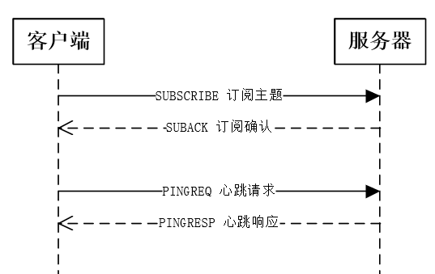
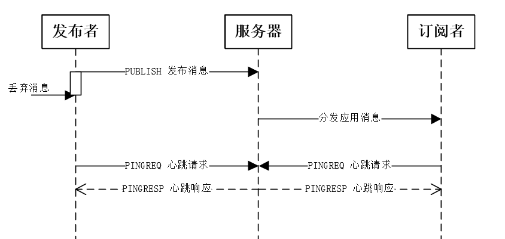
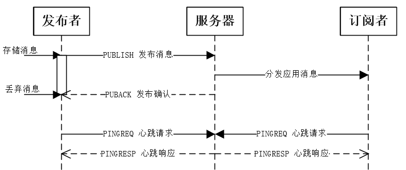
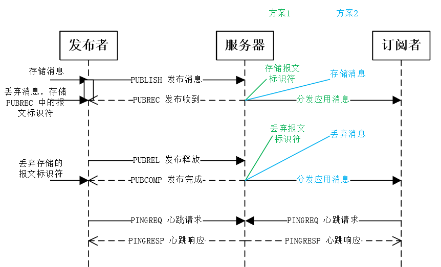
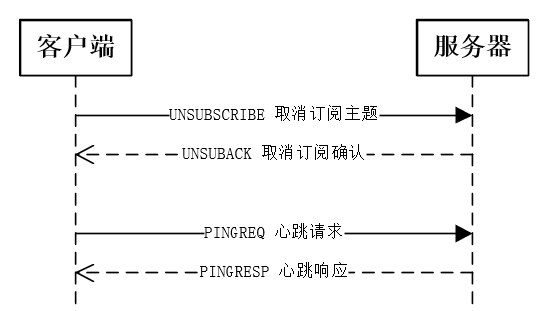
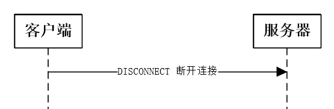

# 0 

[学习摘录自：你不得不看的图文并茂的MQTT协议通信过程！！！]([你不得不看的图文并茂的MQTT协议通信过程！！！__杰杰_的博客-CSDN博客_mqtt通信流程](https://jiejie.blog.csdn.net/article/details/106737995?spm=1001.2014.3001.5502))

# 0.1 目录

[1 MQTT 连接服务器](#connect)

[2 MQTT 订阅主题](#subscribe)

[3 MQTT 发布消息](#pubish)

​	[3.1 服务质量等级 QoS](#Qos)

​	[3.2 QoS0 的 PUBISH 控制报文](#QoS0)

​	[3.3 QoS0 的 PUBISH 控制报文](#QoS1)

​	[3.4 QoS2 的 PUBISH 控制报文](#QoS2)

[4 取消订阅](#unsubscribe)

[5 断开连接](#unconnect)

# 1 MQTT 连接服务器  

客户端到服务器的网络建立后，客户端发送给服务器的第一个报文必须是 `CONNECT` 报文。

在一个网络连接上，客户端只能发送一次 `CONNECT`报文。服务器必须将客户端发送的第二个 `CONNECT`  报文当作协议违规处理并断开客户端的连接。

服务器发送 `CONNACK` 报文响应从客户端收到的 `CONNECT` 报文。按照协议标准，服务器发送给客户端的第一个报文必须是 `CONNACK` 。

如果客户端在合理的时间内没有收到服务器的 `CONNACK` 报文，客户端应该关闭网络连接。
(*注：合理的时间取决于应用的类型和通信基础设施。*)

# 2 MQTT 订阅主题 

客户端向服务器发送 `SUBSCRIBE` 报文用于创建一个或多个订阅。每个订阅注册客户端关心的一个或多个主题。

在服务器中，会记录这个客户端订阅的一个或多个主题，当服务器收到这些主题的 `PUBLISH` 报文的时候，将分发应用消息到与之匹配的客户端中。

`SUBSCRIBE` 报文支持通配符，也为每个订阅指定了最大的 `QoS` 等级，服务器根据这些信息分发应用消息给客户端。

`SUBSCRIBE` 报文拥有固定报头、可变报头、有效载荷。

当服务器收到客户端发送的一个 `SUBSCRIBE` 报文时，必须向客户端发送一个 `SUBACK` 报文，用于确认它已收到并且正在处理 `SUBSCRIBE` 报文，同时 `SUBACK` 报文必须和等待确认的 `SUBSCRIBE` 报文有相同的报文标识符。

如果服务器收到一个 `SUBSCRIBE` 报文，报文的主题过滤器与一个现存订阅的主题过滤器相同，那么必须使用新的订阅彻底替换现存的订阅。新订阅的主题过滤器和之前订阅的相同，但是它的最大 `QoS` 值可以不同。与这个主题过滤器匹配的任何现存的保留消息必须被重发，但是发布流程不能中断。

`SUBSCRIBE` 报文的有效载荷包含了一个主题过滤器列表，它们表示客户端想要订阅的主题，`SUBSCRIBE` 报文有效载荷中的主题过滤器列表必须是 `UTF-8` 字符串。

服务器应该支持包含通配符的主题过滤器。如果服务器选择不支持包含通配符的主题过滤器，必须拒绝任何包含通配符过滤器的订阅请求。

每一个过滤器后面跟着一个字节，这个字节被叫做服务质量要求（Requested QoS）。它给出了服务器向客户端发送应用消息所允许的最大 `QoS` 等级。

# 3 MQTT 发布消息  

`PUBLISH` 控制报文是指从客户端向服务器或者服务器向客户端发送一个应用消息。其实从服务器分发的报文给订阅者，也是属于 `PUBLISH` 控制报文。

## 3.1 服务质量等级QoS  

`QoS` 的值表示应用消息分发的服务质量等级保证，在不同的服务质量等级中，`PUBLISH` 控制报文的处理方式也是不同的，而且 `PUBLISH` 报文的接收者（可以是服务器，也可以是客户端）必须按照根据 `PUBLISH` 报文中的 `QoS` 等级发送对应的应答报文。

| QoS 值 | Bit2 | Bit1 | 描述         |
| ------ | ---- | ---- | ------------ |
| 0      | 0    | 0    | 最多分发一次 |
| 1      | 0    | 1    | 至少分发一次 |
| 2      | 1    | 0    | 只分发一次   |
| -      | 1    | 1    | 保留位       |

`MQTT` 按照这里定义的服务质量 (QoS) 等级分发应用消息。服务器分发应用消息给多个客户端（订阅者）时，每个客户端独立处理。从发布者发布消息到接受者，分发的消息服务质量可能是不同的，这取决于订阅者订阅主题时指定的服务质量等级。而对于发布者而言，发布消息时就指定了服务质量等级。

## 3.2 QoS0 的 PUBISH 控制报文  

消息的分发依赖于底层网络的能力。服务器不会发送响应，发布者也不会重试，它在发出这个消息的时候就立马将消息丢弃，这个消息可能送达一次也可能根本没送达。

- 发送者
  - 必须发送 `QoS` 等于 `0` ，`DUP` 等于 `0` 的 `PUBLISH` 报文
- 接收者
  - 接受 `PUBLISH` 报文时同时接受消息的所有权，将消息分发给订阅该主题（消息）的订阅者

## 3.3 QoS1 的 PUBISH 控制报文  

服务质量确保消息至少送达一次，甚至可能被多次处理。`QoS1` 的 `PUBLISH` 报文的可变报头中包含一个报文标识符，需要 `PUBACK` 报文确认。

- 发送者
  - 每次发送新的应用消息都必须分配一个未使用的报文标识符。
  - 发送的 `PUBLISH`报文必须包含报文标识符且 `QoS == 1` ，`DUP == 0`。
  - 必须将这个 `PUBLISH` 报文看作是未确认的，直到从接收者那收到对应的 `PUBACK` 报文。
- 接收者
  - 响应的 `PUBACK` 报文必须包含一个报文标识符，这个标识符来自接收到的、已经接受所有权的 `PUBLISH` 报文。
  - 发送了 `PUBACK` 报文之后，接收者必须将任何包含相同报文标识符的入站 `PUBLISH` 报文当作一个新的消息，并忽略它的 `DUP` 标志的值。

## 3.4 QoS2 的 PUBISH 控制报文  

这是最高等级的服务质量，消息丢失和重复都是不可接受的。使用这个服务质量等级会有额外的开销。

`QoS2` 的消息可变报头中有报文标识符。`QoS2` 的 `PUBLISH` 报文的接收者使用一个两步确认过程来确认收到。

- 发送者
  - 必须给要发送的新应用消息分配一个未使用的报文标识符。
  - 发送的 `PUBLISH` 报文必须包含报文标识符且报文的 `QoS == 2`，`DUP == 0`。
  - 在消息发送出去后，需要将这个消息存储起来，必须将这个 `PUBLISH` 报文看作是未确认的 ，直到从接收者那收到对应的 `PUBREC` 报文。
  - 收到 `PUBREC` 报文后必须发送一个 `PUBREL` 报文。`PUBREL` 报文必须包含与原始 `PUBLISH` 报文相同的报文标识符。
  - 必须将这个 `PUBREL` 报文看作是未确认的 ，直到从接收者那收到对应的 `PUBCOMP` 报文。
  - 一旦发送了对应的 `PUBREL` 报文就不能重发这个 `PUBLISH` 报文。
- 接收者
  - 响应的 `PUBREC` 报文必须包含报文标识符，这个标识符来自接收到的、已经接受所有权的 `PUBLISH` 报文。
  - 在收到对应的 `PUBREL` 报文之前，接收者必须发送 `PUBREC` 报文确认任何后续的具有相同标识符的 `PUBLISH` 报文。 在这种情况下，它不能重复分发消息给任何后续的接收者。
  - 响应 `PUBREL` 报文的 `PUBCOMP` 报文必须包含与 `PUBREL` 报文相同的标识符。
  - 发送 `PUBCOMP` 报文之后，接收者必须将包含相同报文标识符的任何后续 `PUBLISH` 报文当作一个新的发布。

如下所示：

在发布消息的时候，立马存储消息，在收到 `PUBREC` 报文后必须将存储的消息丢弃掉，然后存储报文标识符，与此同时还要将 `PUBREL` 报文发送出去，最后在收到 `PUBCOMP` 报文后，才丢弃存储的报文标识符。

当然啦，对应分发消息也是比较复杂的，它一般有两种处理方案，每一种方案都要确保消息有且只有处理一次。

接收者（此处指服务器）响应的 `PUBREC` 报文必须包含报文标识符，这个标识符来自接收到的 `PUBLISH` 报文。

发送 `PUBREC` 报文后，在收到对应的 `PUBREL` 报文之前，接收者可以将消息分发给订阅者，但是必须要存储报文标识符（方案1）。

当然，它在这种情况下，也可以存储消息，直到收到 `PUBREL` 报文才将消息分发到订阅者（方案2）。

而当它收到 `PUBREL` 报文后，它必须发送 `PUBCOMP` 报文响应发布者，该报文必须包含与 `PUBREL` 报文相同的标识符。

与此同时，它可以丢弃存储的报文标识符（方案1），而不必再分发应用消息给订阅者。

如果此前没有分发应用消息给订阅者（方案2），那么此时需要分发应用消息给订阅者，然后丢弃消息。

在接收者发送 `PUBCOMP` 报文之后，接收者必须将包含相同报文标识符的任何后续 `PUBLISH` 报文当作一个新的发布。

# 4 取消订阅  

客户端发送 `UNSUBSCRIBE` 报文给服务端，用于取消订阅主题。

`UNSUBSCRIBE` 报文固定报头的第3,2,1,0位是保留位且必须分别设置为 `0,0,1,0` 。否则服务器必须认为任何其它的值都是不合法的并关闭网络连接。

`UNSUBSCRIBE` 报文的有效载荷包含客户端想要取消订阅的主题过滤器列表。`UNSUBSCRIBE` 报文中的主题过滤器必须是连续打包的 `UTF-8` 编码字符串。

`UNSUBSCRIBE` 报文的有效载荷必须至少包含一个主题过滤器列表，而且这个主题过滤器是已经被客户端订阅的，否则的话没有订阅也就没有取消订阅一说了。如果一个 `UNSUBSCRIBE` 报文没有有效载荷是违反协议的标准的，服务器也不会去处理它。

而对于服务器删除了一个订阅，那么它将不会再分发该主题的消息到这个客户端中。而且它必须完成分发任何已经开始往客户端发送的 `QoS1` 和 `QoS2` 的消息，以保证消息的服务质量。

然后服务器必须发送 `UNSUBACK` 报文来响应客户端的 `UNSUBSCRIBE` 请求。`UNSUBACK` 报文必须包含和 `UNSUBSCRIBE` 报文相同的报文标识符。即使没有删除任何主题订阅（客户端取消订阅的主题未被订阅），服务器也必须发送一个 `UNSUBACK` 响应。

# 5 断开连接  

`DISCONNECT` 报文是客户端发给服务端的最后一个控制报文。表示客户端正常断开连接。

`DISCONNECT` 报文的固定报头保留位必须全为 `0` ，如果它们不为 `0` 必须断开连接。

客户端发送 `DISCONNECT` 报文之后必须关闭网络连接，不能通过那个网络连接再发送任何控制报文。

服务端在收到 `DISCONNECT` 报文时必须丢弃任何与当前连接关联的未发布的遗嘱消息。而且当客户端没有关闭网络连接的时候服务器应该主动去关闭网络连接。

